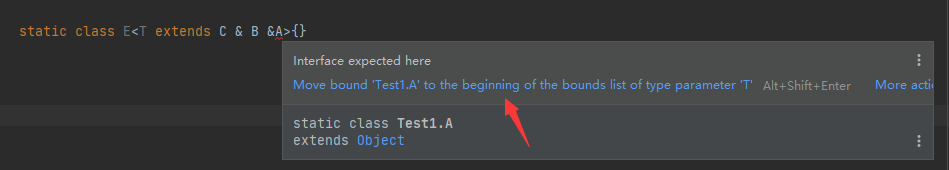
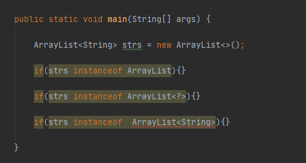
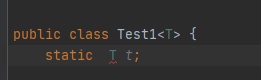

# Javagenericity
> 泛型定义

jdk1.5开始引入的一种参数化类型特性，参数化类型就是把类型当参数一样传递

举个例子：

Test<T>  "T"类型参数，“Test<T>”泛型类型

Test<String>  "String" 实际类型参数，**Test<String>参数化类型 ParameterizedType**


> 泛型好处

1. 代码健壮（只要编译器没警告，运行期就不会出现类型转换异常错误）
2. 代码更加简洁不用强转
3. 代码灵活增加复用


> 泛型在Java中使用

1. 泛型类

   ```java
   class Test<T>{
       T  t;
       
       
       public T getKey(){ //TODO 不是泛型方法没有<T>
           return t;
       }
   }
   ```

   

2. 泛型接口

   ```java
   interface Test<T>{
   
   }
   ```

   

3. 泛型方法

   ```java
   <T> T fun(){  //TODO <T>  表明是泛型方法
   
   }
   ```


> 泛型extends多个限定类型，限定类型排放有要求，先类后接口

```java
public class Test1 {

    static class A {
    }

    interface B {
    }

    interface C {
    }

    //TODO  A 属于类必须放在前面
    //TODO 而且不能多继承类，放了A就不能放其他泛型类了
    static class D<T extends A & C & B> {
    }

}

```




以上不按类优先排放会报错


> 泛型原理

泛型是Jdk1.5才引入的，为了向下兼容，虚拟机实际上是不支持泛型的，java泛型实际上是一种伪泛型机制，

在编译器会被擦除所有的泛型信息，所有的泛型类型最终都是一种原始类型，Java运行时不存在泛型


> 编译器具体时如何作泛型擦除的

1. 擦除泛型变量替换成限定类型

   如果泛型类型没有限定如 Test<T>则使用Object替换

   如果有如Test<T extends String>则使用String替换

   如果有多个则用第一个替换如Test<T extends String & XXInterface>则使用String替换

2. 必要时插入类型转换确保类型安全

3. 生成桥方法保持扩展时的多态性


> 泛型擦除带来的副作用

1. 不能使用List<int> list;导致基础类型不能作泛型参数，因为类型擦除之后直接替换成Object,Object不能存放基础类型

2.不能使用instanceof运算


3.不能使用泛型静态变量


=======


3.不能使用泛型静态变量



>

4.泛型类型导致方法冲突


